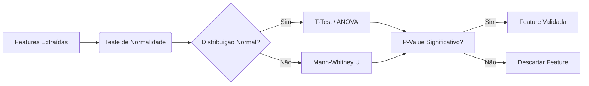

# Análise Exploratória de Dados

Após o processamento dos sinais, é necessário validar estatisticamente se as características (features) extraídas possuem poder discriminativo real.

Esta etapa utiliza os scripts `eda_stat_analysis` e `feature_importance`.

## Conjunto de Features

Foram extraídas um total de **45 features numéricas** de janelas de 60 segundos, abrangendo domínios estatísticos, temporais e frequenciais.

| Sensor | Features Extraídas |
| :--- | :--- |
| **BVP / VFC** | `Mean_PP`, `std_PP`, `M_HR` (Frequência Cardíaca), `std_H`, `HF` (Alta Frequência), `SD2` (Poincaré), estatísticas do sinal bruto (`bvp_mean`, `bvp_std`...) e suas derivadas (`bvp_d1_...`, `bvp_d2_...`). |
| **EDA** | `eda_mean`, `eda_median`, `eda_std`, `eda_min`, `eda_max`, `eda_mode`, `SCR_Peaks` (Picos de condutância), `eda_slope`. |
| **ACC** | `acc_mean`, `acc_median`, `acc_std`, `acc_min`, `acc_max`, `acc_mode` (Baseado na magnitude vetorial). |
| **TEMP** | `temp_mean`, `temp_median`, `temp_std`, `temp_min`, `temp_max`, `temp_mode`, `temp_slope`. |

---

## Validação Estatística
Este módulo realiza testes de hipótese para verificar se existe uma diferença estatisticamente significativa entre os estados de Estresse e Repouso para cada feature.

### Testes de Normalidade

Como dados fisiológicos frequentemente não seguem uma curva de sino perfeita (distribuição Gaussiana), aplicamos testes para decidir qual método estatístico usar:

- Shapiro-Wilk, para amostras menores.
- Anderson-Darling, para amostras maiores e caudas pesadas.

> A análise do conjunto indicou que nenhuma das features segue uma distribuição normal perfeita ($\rho < 0.05$). Isso é esperado em dados fisiológicos.

| Feature | Shapiro-Wilk ($p$-value) | Normal? | Anderson-Darling Stat |
| :--- | :--: | :---: | :--: |
| `Mean_PP` | $2.10 \times 10^{-7}$ | Não | 1.98 |
| `eda_mean` | $1.33 \times 10^{-31}$ | Não | 71.02 |
| `bvp_mean` | $1.12 \times 10^{-15}$ | Não | 9.75 |
| `M_HR` | $4.08 \times 10^{-4}$ | Não | 1.25 |

> Devido à não-normalidade dos dados, optou-se por utilizar testes **não-paramétricos** (Teste Mann-Whitney-U) para a comparação entre grupos.

#### Comparação de Distribuições

Dado que a maioria das nossas features possui distribuição não-paramétrica, utilizamos o teste *Mann-Whitney U*.

Foi considerada que uma feature seria válida se o teste de hipótese retornar um $\rho$-valor < 0.05 ($\rho$<0.05), rejeitando a hipótese nula de que as distribuições de Estresse e Repouso são iguais.

{ align=left }

<figure markdown="span">
   { width="300" }
  <figcaption>Fig 1. A mediana da EDA durante o estresse (laranja) é visivelmente superior ao repouso (azul), corroborando o p-valor extremamente baixo encontrado.*</figcaption>
</figure>

##### Features Altamente Significativas
As features de Atividade Eletrodérmica (EDA) mostraram a maior separação entre os estados, confirmando a literatura sobre resposta galvânica ao estresse.

| Feature | Rest Median | Stress Median | Diff Median | $p$-value | Significativo? |
| :--- | :---: | :---: | :---: | :---: | :---: |
| **`eda_mean`** | 0.255 | **0.504** | +0.249 | $1.02 \times 10^{-8}$ | Sim |
| **`eda_min`** | 0.221 | **0.453** | +0.232 | $1.49 \times 10^{-9}$ | Sim |
| **`eda_max`** | 0.290 | **0.580** | +0.290 | $< 0.001$ | Sim |

### Features Não Significativas
Algumas features estatísticas do sinal bruto de BVP não conseguiram distinguir os estados ($\rho$-valor alto, indicando que as distribuições se sobrepõem).

| Feature | Rest Median | Stress Median | $p$-value | Significativo? |
| :--- | :---: | :---: | :---: | :---: |
| `bvp_std` | 49.77 | 49.71 | 0.683 | Não |
| `bvp_d2_mean` | -0.0001 | 0.0001 | 0.641 | Não |

## Importância das Features

Com dezenas de métricas extraídas, precisamos identificar quais são as "protagonistas" da classificação. Isso evita o overfitting (curse of dimensionality) e melhora a interpretabilidade do modelo.

### Métodos de Seleção

Utilizamos uma abordagem híbrida para rankear as variáveis:

#### Filter Methods (Estatísticos):

- Qui-Quadrado (χ2) que irá medir a dependência estocástica entre a feature e o alvo.

- Correlação de Pearson que nos identificaa colinearidade (features muito correlacionadas entre si, como `Mean_HR` e `Min_HR`, podem ser redundantes).

#### Embedded Methods (Baseado em Modelo):

Random Forest Importance: Treina uma floresta aleatória e calcula a *Impureza de Gini*. Features que, quando usadas para dividir um nó, reduzem mais a impureza, são consideradas mais importantes.

### Ranking de Importância

O gráfico abaixo exibe as features mais relevantes encontradas pelo modelo Random Forest.

!!! info "Interpretação" Geralmente, observamos que features da EDA (como Mean_Amp e N_Peaks) dominam o topo do ranking, confirmando a literatura de que a condutância da pele é o indicador mais robusto de "arousal" (excitação) do Sistema Nervoso Simpático.

### Árvore de Decisão Explicável

Para visualizar os "cortes" (thresholds) decisivos, plotamos uma única árvore do nosso ensemble: