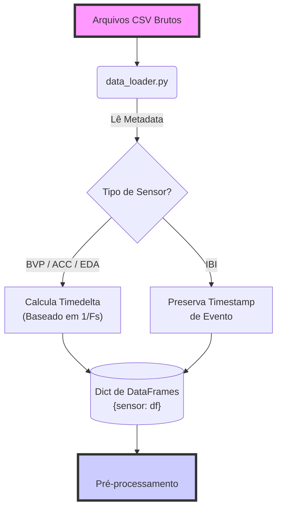
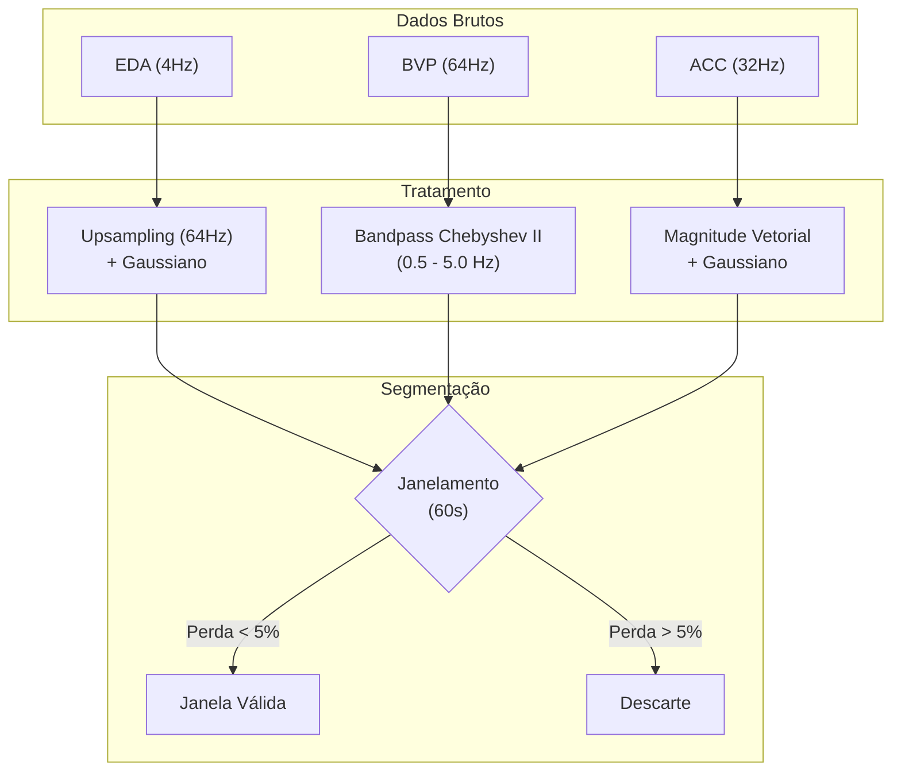

# Processamento de Sinais

O primeiro passo crítico em uma pipeline de processamento de sinais de saúde é a ingestão correta dos dados brutos. Neste projeto, foi utilizado o dataset 'Empatica4Stress'[[1]](#ref1) como modelo para construir nosso módulo de carregamento.

Este artigo detalha o funcionamento dos módulos 'data_loader', 'feature_extraction', 'labeling' e 'preprocessing'

**Fluxo de Dados:** `data_loader` $\rightarrow$ `preprocessing` $\rightarrow$ `feature_extraction` $\rightarrow$ `labeling`

## Dados Multimodais

O dispositivo 'Empatica E4' coleta dados de diversos sensores simultaneamente. O maior desafio na ingestão desses dados é que cada sensor opera em uma Taxa de Amostragem (Sampling Rate) diferente:

Sensor,Descrição,Taxa de Amostragem (Hz)
BVP,Fotopletismografia (Volume de Sangue),64 Hz
ACC,Acelerômetro (Movimento 3 eixos),32 Hz
EDA,Atividade Eletrodérmica (Suor/Estresse),4 Hz
TEMP,Temperatura da Pele,4 Hz

Isso significa que, para um mesmo intervalo de tempo, teremos 64 pontos de dados para o BVP, mas apenas 4 pontos para a EDA. O 'data_loader' deve normalizar essa discrepância temporal.

## Estrutura do Data Loader

O módulo é responsável por ler os arquivos .csv brutos gerados pelo dispositivo e transformá-los em estruturas manipuláveis com indexação temporal relativa.

### Leitura de Arquivos

Os arquivos CSV do Empatica possuem um cabeçalho específico nas duas primeiras linhas:

    - Linha 0: Timestamp de início (Unix epoch).
    - Linha 1: Taxa de amostragem (Hz).
    - Linha 2+: Dados brutos.

O nosso 'loader' lê esses metadados separadamente para configurar a frequência correta de cada sinal antes de carregar o restante dos dados.

### Conversão para Timedelta

Em vez de trabalhar com datas absolutas, que podem complicar a fusão de dados de diferentes sessões ou sujeitos, optamos por converter o índice para Timedelta, que é o tempo decorrido desde o início da gravação.

A lógica aplicada é:
$t_i = \frac{i}{f_s}$

Onde, $t_i$ refere-se ao rempo em segundos do índice da amostra $i$ e $f_s$ é a frequência de amostragem do sensor.

> "Por que Timedelta?" Usar Timedelta facilita o alinhamento de janelas, por exemplo podemos pegar os primeiros 60 segundos, independentemente da hora do dia em que o experimento foi realizado.

### Tratamento do Intervalo Interbatimento (IBI)

O IBI, ou Intervalo Interbatimento, refere-se a um tempo tempo preciso, geralmente em milissegundos, entre dois batimentos cardíacos consecutivos, sendo uma medida fundamental para analisar a variabilidade da frequência cardíaca (VFC) e  revela como o sistema nervoso autonomo(SNA) responde ao estresse ou repouso, uma variação normal é algo boam, enquanto IBIs excessivamente consistentes ou irregulares podem indicar problemas. 

Ele não possui uma taxa de amostragem fixa, pois é uma série temporal de eventos. Um dado é gerado apenas quando um pico R é detectado.

O 'data_loader' trata o IBI preservando o timestamp exato de ocorrência de cada batimento, o que é crucial para análises posteriores de VFC (Variabilidade da Frequência Cardíaca) no domínio da frequência.

### Tratamento de Sinais e Engenharia de Atributos

Após a ingestão dos dados brutos, entramos no núcleo do processamento de sinais. Esta etapa transforma séries temporais ruidosas em janelas limpas e, posteriormente, em vetores de características, feature vectors(fv) prontos para modelos de Machine Learning.

### Pré-processamento

O objetivo desta etapa é duplo: limpar o ruído inerente à coleta de dados em ambiente não controlado e segmentar os dados em unidades de tempo comparáveis.

#### Pipeline de Limpeza por Sensor

Cada sensor possui características espectrais e tipos de ruído distintos, exigindo estratégias de filtragem específicas.

##### Atividade Eletrodérmica (EDA)

A EDA é um sinal lento. O principal desafio aqui é o alinhamento temporal com sensores mais rápidos.

- Upsampling: Interpolamos o sinal de 4Hz para 64Hz (mesma frequência do BVP) via interpolação linear. Isso é crucial para que as matrizes de dados tenham o mesmo tamanho durante a segmentação.

- Suavização:  um Filtro Gaussiano (sigma=400ms) para remover micro-flutuações e ruído de quantização, preservando a morfologia macro das respostas de condutância (SCR).

##### Fotopletismografia (BVP)

O sinal de volume sanguíneo é suscetível a artefatos de movimento e variações de linha de base.

- Filtro Passa-Banda (Bandpass): Utilizamos um filtro Chebyshev Tipo II (Ordem 4, Atenuação 20dB), com faixa de 0.5 Hz a 5.0 Hz, pois ela corresponde a uma frequência cardíaca entre 30 bpm e 300 bpm, cobrindo todo o espectro fisiológico humano e eliminando ruídos de baixa frequência (respiração/movimento lento) e alta frequência (elétrico).

- Utilizamos a função 'sosfiltfilt' que é uma filtragem bidirecional para garantir que não haja deslocamento de fase, o que alteraria a localização temporal dos picos sistólicos.

##### Acelerometria (ACC)

Para medir a intensidade do movimento independentemente da posição do braço do usuário, calculamos a Magnitude Vetorial:

$$Mag_{ACC} = \sqrt{x^2 + y^2 + z^2}$$

Em seguida, aplicamos uma suavização Gaussiana '(sigma=5)' para atenuar a vibração e focar no movimento voluntário.

##### Segmentação (Janelamento)

Os dados contínuos são fatiados em janelas de 60 segundos.

se uma janela contiver menos de 95% dos dados esperados, por exemplo devido a uma queda de conexão, ela é descartada. Isso evita que o modelo aprenda com janelas incompletas ou corrompidas.

### Extração de Características

Com as janelas limpas, extraímos métricas estatísticas e fisiológicas que servem como inputs para o classificador.

#### Features de BVP (Variabilidade da Frequência Cardíaca)

A VFC é o padrão-ouro para detecção de estresse autonômico, com o Dominio do tempo podemos focar na estatística dos intervalos entre picos,  `Mean_PP`, `std_PP` para a média e desvio padrão dos intervalos pico-a-pico e `M_HR` Média da frequência cardíaca instantânea. Com Domínio da Frequência a `HF` (High Frequency) apresenta-se como a potência na banda 0.15–0.4 Hz, calculada via método de Welch. Esta métrica é  associada à atividade parassimpática de relaxamento. E por fim a Não-Linear onde o `SD2` (Poincaré Plot) vai representar a variabilidade de longo prazo e correlaciona-se com a atividade simpática e parassimpática global.

#### Features de EDA (Resposta Galvânica)

A EDA é decomposta em nível tônico (linha de base) e fásico (respostas rápidas a estímulos - SCR), primeiro é feita a detecção de picos (SCR), utilizando uma técnica de convolução com janela Bartlett de 20 pontos na derivada do sinal. Isso atua como um detector de bordas `matched filter` para encontrar subidas abruptas de condutância, típicas de estresse agudo. Assim temos a extração das métricas, `N_PEAKS` que é a quantidade de picos na janela, tambem podemos dizer que é a frequência de estímulos; `M_Amp`, a amplitude média dos picos ou a intensidade da reação; `M_RT` (Rise Time) que é o tempo médio de subida do pico.

### Rotulagem

A etapa final antes do treinamento é atribuir um rótulo (y) para cada janela de dados (X). O sistema vai suportar duas estratégias:

#### Método 1: Protocolo Temporal

Os rótulos são atribuídos baseados em timestamps pré-definidos.

    - Das 14:00 às 14:20 = Stress; 
    - Restante = Baseline.

#### Método 2: Limiar Fisiológico

Defimos o `Stress = 1` ou `Repouso = 0`se a média da EDA na janela for superior a um limiar $T$. O limiar pode ser fixo ou adaptativo por exemplo $T=μ_{\text{sujeito}}​+σ_{\text{sujeito}}​$.

## Referências Bibliográficas

1.  Empatica Inc. (2020). *E4 wristband user's manual*. Recuperado de [https://www.empatica.com/en-eu/research/e4/](https://www.empatica.com/en-eu/research/e4/)
2.  Task Force of the European Society of Cardiology and the North American Society of Pacing and Electrophysiology. (1996). Heart rate variability: standards of measurement, physiological interpretation and clinical use. *Circulation*, *93*(5), 1043-1065.
3.  Boucsein, W. (2012). *Electrodermal activity* (2nd ed.). Springer Science & Business Media.
4.  Schmidt, P., Reiss, A., Duerichen, R., Marberger, C., & Van Laerhoven, K. (2018). Introducing WESAD, a multimodal dataset for wearable stress and affect detection. In *Proceedings of the 20th ACM International Conference on Multimodal Interaction* (pp. 400-408).

