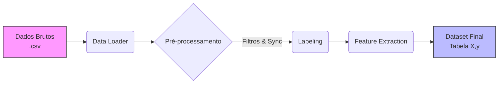
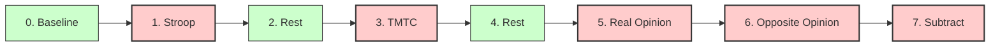
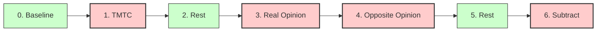
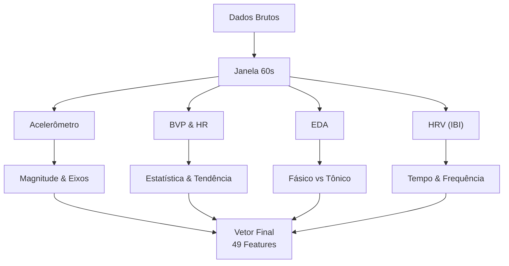

# Pipeline de Processamento de Sinais (ETL) - Wearable Stress Dataset

Esta documentação detalha a implementação do pipeline de extração, transformação e carga (ETL) para o processamento de sinais fisiológicos do dispositivo Empatica E4 [[1]](#ref1). O objetivo é preparar os dados brutos do dataset público de Hongn et al. [[5]](#ref5)[[6]](#ref6) para treinamento de modelos de Machine Learning (Baseline).

### Estrutura de Diretórios
```text
├── src/
│   ├── config.py             # Configurações globais e caminhos
│   ├── data_loader.py        # Leitura dos CSVs brutos (Extract)
│   ├── preprocessing.py      # Sincronização e filtros (Transform)
│   ├── labeling.py           # Aplicação de rótulos    (Transform)
│   └── feature_extraction.py # Janelamento e cálculo de métricas (Transform)
├── experiments/
│   ├── notebooks/
│   │   ├── 01_one_subject.ipynb   # Prototipagem e validação, utilizando apenas um sujeito
│   │   └── 02_batch_process.ipynb # Processamento em massa (Load)
│   └── processed/
│       └── dataset_stress_completo.csv # Arquivo final
```

### Fluxograma do Pipeline 




## Etapa 01 - Extração (`data_loader`)

A primeira etapa consiste em carregar os dados brutos gerados pelo Empatica E4.

Desafio consiste em que os arquivos do E4 não possuem cabeçalho padrão e contêm metadados nas primeiras linhas [[1]](#ref1).

A solução encontrada foi a implementação em `src/data_loader.py`, ignorando cabeçalhos de texto, depois convertendo tudo para numérico, forçando erros a virarem NaN e popr fim foi criado um índice temporal baseado na frequência de amostragem:

| Sensor | Descrição | Taxa de Amostragem (Hz)|
|:-----:|:----------|:--------------------:|
| **BVP** | Fotopletismografia | 64 |
| **ACC** | Acelerômetro (Movimento 3 eixos) | 32 |
| **EDA** | Atividade Eletrodérmica (Suor/Estresse) | 4 |
| **TEMP** | Temperatura da Pele | 4 |

Isso significa que, para um mesmo intervalo de tempo, teremos 64 pontos de dados para o BVP, mas apenas 4 pontos para a EDA. O `data_loader` tem a função de normalizar essa discrepância temporal.

## Etapa 2: Transformação (`preprocessing` & `labeling`)

Esta é a fase  onde os dados brutos são limpos e sincronizados.

### Sincronização e Filtragem (`src/preprocessing.py`)
Como cada sensor tem uma frequência diferente, criamos uma "Timeline Mestre" de 4Hz para alinhar todos os sinais.

- EDA (Atividade Eletrodérmica): Aplicamos filtro Gaussiano para remover ruído de movimento de alta frequência [[3]](#ref3).
- ACC (Acelerômetro): Calculamos a Magnitude $\sqrt{x^2+y^2+z^2}$ para ter uma medida única de intensidade de movimento.

### Rotulagem (`src/labeling.py`)

A definição do *Ground Truth* foi adaptada para refletir as diferenças estruturais entre os grupos, conforme detalhado na metodologia do experimento [[5]](#ref5)[[6]](#ref6). O script `src/labeling.py` identifica o protocolo pelo ID do sujeito e aplica os rótulos de estresse (Label 1) nas fases ativas específicas.

#### Protocolo V1 (Grupo `Sxx`)
Estrutura clássica com três blocos de estresse intercalados por repouso. O último bloco é subdividido em três tarefas curtas.

**Sequência de Fases:**

> Stress: Índices `[1, 3, 5, 6, 7]`.

#### Protocolo V2 (Grupo `Fxx`)
Como atualização do protocolo V1 o teste Stroop foi removido, e o segundo período de descanso foi realocado para separar as tarefas de opinião da tarefa de subtração.

**Sequência de Fases:**

> Stress : Índices `[1, 3, 4, 6]`.

### Etapa 3: Engenharia de Features (`src/feature_extraction.py`)

Para treinar modelos clássicos (Random Forest, SVM), não podemos usar o sinal contínuo. Precisamos extrair estatísticas de janelas temporais, assim o janelamento de 60 segundos com sobreposição de 50% (passo de 30s), seguindo a metodologia padrão em datasets como WESAD [[4]](#ref4).

**Fluxo de Extração por Janela**



#### Features de Acelerômetro (Accelerometer)

O sensor ACC mede a movimentação física, nessa parte é importante incluir essas features para que o modelo possa distinguir se uma alteração fisiológica é causada por estresse ou apenas por movimento físico [[1]](#ref1).

- Por Eixo (x, y, z): Média e Desvio Padrão.

- Magnitude: Calculamos a norma do vetor $\sqrt{x^2+y^2+z^2}$​ para ter uma medida de intensidade de movimento independente da orientação do pulso.

- Tendência: ratio_up e ratio_down,  que vem a ser a proporção de tempo que o sinal passa subindo ou descendo.

#### Fotopletismografia (BVP e HR) 

- BVP (Blood Volume Pulse): O sinal bruto óptico. Extraímos média e desvio padrão apenas como descritores estatísticos do sinal cru.

- HR (Heart Rate): A frequência cardíaca processada. Além da média/std, calculamos a inclinação do sinal (ratio) para detectar se os batimentos estão em tendência de subida (ataque de estresse) ou descida (recuperação).

#### Features de EDA (Electrodermal Activity)

Baseado em Boucsein [[3]](#ref3), o sinal de suor é decomposto para separar o nível basal da reação imediata:

- Componente Tônica (SCL): Nível basal de condutância (lenta, indica estresse acumulado).
- Componente Fásica (SCR): Respostas rápidas a estímulos específicos.
- Features: Média, Desvio Padrão, Densidade de Picos (SCR Peaks), Amplitude média.

#### Features de HRV (Heart Rate Variability)

Considerado o padrão-ouro para medir o equilíbrio do sistema nervoso autônomo (Simpático vs Parassimpático) [[2]](#ref2). O cálculo é feito sobre os intervalos entre batimentos (IBI).

**Domínio do Tempo:**

-RMSSD: Raiz quadrada da média do quadrado das diferenças entre iBIs adjacentes. (Vital para curto prazo).

-SDNN: Desvio padrão dos intervalos.

-pNN50/pNN20: Porcentagem de intervalos adjacentes que diferem em mais de 50ms ou 20ms.

- Domínio da Frequência : As features de frequência (LF, HF, VLF) indicam a modulação simpática/vagal.

Durante o desenvolvimento, encontramos um erro de Kernel Crash (Access Violation) ao usar métodos baseados em `FFT` [[9]](#ref9)(Fast Fourier Transform) via `scipy.interpolate`. Isso ocorria porque o intervalo entre batimentos (IBI) é irregular, para resolver esse problema substituímos a `FFT` pelo Periodograma de Lomb-Scargle[[8]](#ref8). Este método calcula a densidade espectral de potência diretamente de dados espaçados irregularmente, sem necessidade de interpolação, sendo mais robusto e leve para processamento de IBI.

A execução do pipeline resulta em um vetor de 49 features por janela, conforme detalhado abaixo:


| Sinal (Qtd) | Tipo | Features |
| :--- | :--- | :--- |
| **BVP (2)** | Estatístico | `bvp_mean`, `bvp_std` |
| **HR (4)** | Estatístico | `hr_mean`, `hr_std`, `hr_ratio_down`, `hr_ratio_up` |
| **HRV (20)** | Domínio Tempo | `max_ibi`, `min_ibi`, `mean_ibi`, `hr_mean_ibi`, `pnn20`, `pnn50`, `rmssd`, `sdnn` |
| | Domínio Freq. | `total_power`, `ratio`, `VLF_power`, `VLF_peak`, `LF_power`, `LF_peak`, `LF_n`, `HF_power`, `HF_peak`, `HF_n`, `VHF_power`, `VHF_peak` |
| **EDA (13)** | Estatístico | `mean_raw_eda`, `std_raw_eda` |
| | Decomposição | `mean_tonic_eda`, `std_tonic_eda`, `mean_phasic_eda`, `std_phasic_eda`, `tonic_ratio_down`, `tonic_ratio_up` |
| | Eventos SCR | `peaks_density`, `scr_mean_amp`, `scr_mean_height`, `scr_mean_risetime`, `scr_mean_recoverytime` |
| **ACC (10)** | Estatístico | `acc_x_mean`, `acc_x_std`, `acc_y_mean`, `acc_y_std`, `acc_z_mean`, `acc_z_std` |
| | Magnitude | `acc_mean`, `acc_std`, `acc_ratio_down`, `acc_ratio_up` |

### Etapa 4: Carga (Batch Processing)

Implementado no notebook `02_batch_process.ipynb`. O script itera sobre as pastas de todos os sujeitos disponíveis no dataset [[7]](#ref7).

- Carrega dados brutos.
- Sincroniza sinais.
- Aplica labels baseados nas tags.
- Extrai features janeladas.
- Adiciona coluna subject_id para validação cruzada.
- Concatena tudo e salva em `dataset_stress_completo.csv`.

**Resultado Final:**
- Sujeitos Processados com Sucesso: 36
- Total de Janelas Geradas: 2904
- Total de Features (Colunas): 52

**Distribuição de Classes:**
| label | # |
| ----- | :-: |
| Rest | 1799|
| Stress | 1105|


<div style="display: none;">

## Referências Bibliográficas

1. <span id="ref1"></span> Empatica Inc. (2020). *E4 wristband user's manual*. Recuperado de [https://www.empatica.com/en-eu/research/e4/](https://www.empatica.com/en-eu/research/e4/)
2. <span id="ref2"></span> Task Force of the European Society of Cardiology and the North American Society of Pacing and Electrophysiology. (1996). Heart rate variability: standards of measurement, physiological interpretation and clinical use. *Circulation*, *93*(5), 1043-1065.
3. <span id="ref3"></span> Boucsein, W. (2012). *Electrodermal activity* (2nd ed.). Springer Science & Business Media.
4. <span id="ref4"></span> Schmidt, P., Reiss, A., Duerichen, R., Marberger, C., & Van Laerhoven, K. (2018). Introducing WESAD, a multimodal dataset for wearable stress and affect detection. In *Proceedings of the 20th ACM International Conference on Multimodal Interaction* (pp. 400-408).
5. <span id="ref5"></span> Hongn, A., Bosch, F., Prado, L., & Bonomini, P. (2025). Wearable Device Dataset from Induced Stress and Structured Exercise Sessions (version 1.0.1). PhysioNet. RRID:SCR_007345. https://doi.org/10.13026/he0v-tf17
6. <span id="ref6"></span> Hongn, A., Bosch, F., Prado, L. E., Ferrández, J.M., & Bonomini, M. P. (2025). Wearable Physiological Signals under Acute Stress and Exercise Conditions. Scientific Data, 12(1). https://doi.org/10.1038/s41597-025-04845-9
7. <span id="ref7"></span> Goldberger, A., et al. (2000). PhysioBank, PhysioToolkit, and PhysioNet: Components of a new research resource for complex physiologic signals. Circulation [Online]. 101 (23), pp. e215–e220.
8. <span id="ref8"></span>Bretthorst, G.. (2000). Generalizing the Lomb-Scargle Periodogram. Maximum Entropy and Bayesian Methods in Science and Engineering. 568. 10.1063/1.1381888. 
9. <span id="ref9"></span>E. O. Brigham and R. E. Morrow, "The fast Fourier transform," in IEEE Spectrum, vol. 4, no. 12, pp. 63-70, Dec. 1967, doi: 10.1109/MSPEC.1967.5217220. keywords: {Fast Fourier transforms;Fourier transforms;Laplace equations;Differential equations;Discrete Fourier transforms;Problem-solving;Frequency synthesizers;Fourier series;Differential algebraic equations;Data analysis}, 


