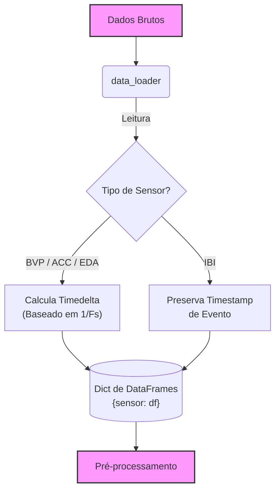
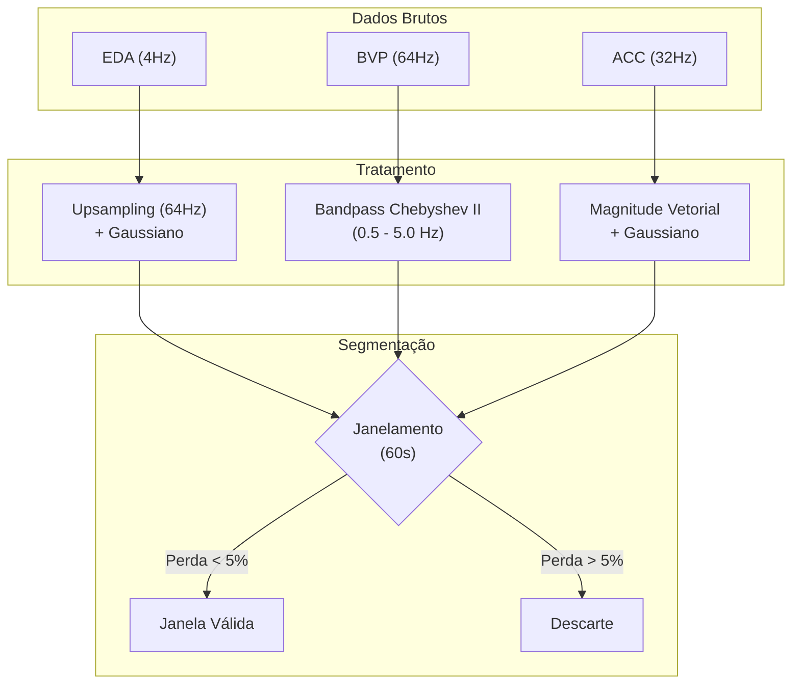

# Processamento de Sinais

O primeiro passo crítico em uma pipeline de processamento de sinais de saúde é a ingestão correta dos dados brutos. Neste projeto, foi utilizado o dataset **Empatica4Stress**[[1]](#ref1) como modelo para construir nosso módulo de carregamento.

Este artigo detalha o funcionamento dos módulos `data_loader`, `preprocessing`, `feature_extraction` e `labeling`.

**Fluxo do Pipeline:**
`data_loader` $\rightarrow$ `preprocessing` $\rightarrow$ `feature_extraction` $\rightarrow$ `labeling`

---

## 1. Ingestão de Dados (`data_loader`)

Este módulo tem a função de ingerir os dados brutos pela leitura dos arquivos CSV gerados pelo dispositivo **Empatica E4**[[1]](#ref1).

### O Desafio dos Dados Multimodais
O dispositivo coleta dados de diversos sensores simultaneamente. O maior desafio na ingestão desses dados é que cada sensor opera em uma **Taxa de Amostragem (Sampling Rate)** diferente:

| Sensor | Descrição | Taxa de Amostragem (Hz)|
|:-----:|:----------|:--------------------:|
| **BVP** | Fotopletismografia | 64 |
| **ACC** | Acelerômetro (Movimento 3 eixos) | 32 |
| **EDA** | Atividade Eletrodérmica (Suor/Estresse) | 4 |
| **TEMP** | Temperatura da Pele | 4 |

Isso significa que, para um mesmo intervalo de tempo, teremos 64 pontos de dados para o BVP, mas apenas 4 pontos para a EDA. O `data_loader` tem a função de normalizar essa discrepância temporal.

### Leitura de Arquivos e Sincronização
Os arquivos CSV do Empatica possuem um cabeçalho específico ("headless") nas duas primeiras linhas:
* **Linha 0:** Timestamp de início.
* **Linha 1:** Taxa de amostragem (Hz).
* **Linha ...:** Dados brutos.

O nosso `data_loader` lê esses dados separadamente para configurar a frequência correta de cada sinal antes de carregar o restante dos dados.

### Conversão para Timedelta
Em vez de trabalhar com datas absolutas, que podem complicar a fusão de dados de diferentes sessões ou sujeitos, optou-se por converter o índice para **Timedelta**, que é o tempo decorrido desde o início da gravação.

A lógica aplicada é:

$$t_i = \frac{i}{f_s}$$

Onde, $t_i$ refere-se ao tempo em segundos do índice da amostra $i$ e $f_s$ é a frequência de amostragem do sensor.

!!! quote "Por que Timedelta?"
    Usar Timedelta facilita o alinhamento de janelas. Por exemplo, podemos pegar os primeiros 60 segundos, independentemente da hora do dia em que o experimento foi realizado.

### Tratamento do Intervalo Interbatimento (IBI)
O IBI (Intervalo Interbatimento) refere-se ao tempo preciso, geralmente em milissegundos, entre dois batimentos cardíacos consecutivos. É uma medida fundamental para analisar a variabilidade da frequência cardíaca (VFC) e revela como o sistema nervoso autônomo (SNA) responde ao estresse ou repouso. Uma variação normal é algo bom, enquanto IBIs excessivamente consistentes ou irregulares podem indicar problemas.

Ele não possui uma taxa de amostragem fixa, pois é uma **série temporal de eventos**. Um dado é gerado apenas quando um pico R é detectado. O `data_loader` trata o IBI preservando o timestamp exato de ocorrência de cada batimento, o que é crucial para análises posteriores de VFC no domínio da frequência.

### Pré-processamento

Após a ingestão, entramos no núcleo do processamento. O objetivo desta etapa é duplo: limpar o ruído inerente à coleta de dados em ambiente não controlado e segmentar os dados em unidades de tempo comparáveis.

#### Pipeline de Limpeza por Sensor

Cada sensor possui características espectrais e tipos de ruído distintos, exigindo estratégias de filtragem específicas.

#### Atividade Eletrodérmica (EDA)
A EDA reflete mudanças na condutividade elétrica da pele, que podem vir de estímulos internos ou externos. Esses estímulos refletem em alterações na atividade das glândulas sudoríparas écrinas, que são inervadas pelo Sistema Nervoso Simpático (SNS) [[3]](#ref3). 

O principal desafio técnico aqui é o alinhamento temporal com sensores mais rápidos.

* **Upsampling:** Realiza-se a interpolação do sinal de 4Hz para 64Hz (mesma frequência do BVP) via interpolação linear, de maneira que as matrizes de dados tenham o mesmo tamanho durante a segmentação.
* **Suavização:** Aplicação de um Filtro Gaussiano (`sigma=400ms`) para remover micro-flutuações e ruído de quantização, preservando a morfologia macro das respostas de condutância (SCR).

#### Fotopletismografia (BVP)
O sinal de volume sanguíneo é suscetível a artefatos de movimento e variações de linha de base.
* **Filtro Passa-Banda (Bandpass):** Utilizamos um filtro **Chebyshev Tipo II** (Ordem 4, Atenuação 20dB), com faixa de **0.5 Hz a 5.0 Hz**. Essa faixa corresponde a uma frequência cardíaca entre 30 bpm e 300 bpm, cobrindo todo o espectro fisiológico humano e eliminando ruídos de baixa frequência (respiração/movimento lento) e alta frequência (elétrico).
* **Fase Zero:** Utilizamos a função `sosfiltfilt` (filtragem bidirecional) para garantir que não haja deslocamento de fase, o que alteraria a localização temporal dos picos sistólicos.

#### Acelerometria (ACC)
Para medir a intensidade do movimento independentemente da posição do braço do usuário, calculamos a Magnitude Vetorial:

$$Mag_{ACC} = \sqrt{x^2 + y^2 + z^2}$$

Em seguida, aplicamos uma suavização Gaussiana (`sigma=5`) para atenuar a vibração e focar no movimento voluntário.

### Segmentação (Janelamento)
Os dados contínuos são fatiados em janelas de **60 segundos**.

#### Controle de Qualidade
Se uma janela contiver menos de **95%** dos dados esperados, como por exemplo devido a uma queda de conexão, ela é descartada. Isso evita que o modelo aprenda com janelas incompletas ou corrompidas.

### Extração de Características

Com as janelas limpas, transformamos as séries temporais em vetores de características (feature vectors) prontos para modelos de Machine Learning.

#### Features de BVP (Variabilidade da Frequência Cardíaca)

A VFC é o padrão-ouro para detecção de estresse autonômico.

- Domínio do Tempo: Focamos na estatística dos intervalos entre picos. `Mean_PP`, `std_PP` (média e desvio padrão dos intervalos pico-a-pico) e `M_HR` (Média da frequência cardíaca instantânea).

- Domínio da Frequência: A `HF` (High Frequency) apresenta-se como a potência na banda 0.15–0.4 Hz, calculada via método de Welch. Esta métrica é associada à atividade parassimpática de relaxamento.

- Não-Linear: O `SD2` (Poincaré Plot) representa a variabilidade de longo prazo e correlaciona-se com a atividade simpática e parassimpática global.

#### Features de EDA (Resposta Galvânica)

A EDA é decomposta em nível tônico (linha de base) e fásico (respostas rápidas a estímulos - SCR).

- Detecção: Primeiro é feita a detecção de picos (SCR), utilizando uma técnica de convolução com janela Bartlett de 20 pontos na derivada do sinal. Isso atua como um detector de bordas (matched filter) para encontrar subidas abruptas de condutância, típicas de estresse agudo.

- Métricas:

    - `N_PEAKS`: Quantidade de picos na janela (frequência de estímulos).
    - `M_Amp`: Amplitude média dos picos (intensidade da reação).
    - `M_RT` (Rise Time): Tempo médio de subida do pico.

### Rotulagem

A etapa final antes do treinamento é atribuir um rótulo (y) para cada janela de dados (X). O sistema vai suportar duas estratégias:

A etapa final antes do treinamento é atribuir um rótulo (y) para cada janela de dados (X). O sistema suporta duas estratégias:

- Método 1: Protocolo Temporal onde os rótulos são atribuídos baseados em timestamps pré-definidos.
    - Das 14:00 às 14:20 = Stress
    - Restante = Baseline

- Método 2: Limiar Fisiológico, onde é definida binariamente rotulos de Stress = 1 ou= 1 ou Repouso = 0 se a média da EDA na janela for superior a um limiar T. O limiar pode ser fixo ou adaptativo, por exemplo:

$$T = \mu_{\text{sujeito}} + \sigma_{\text{sujeito}}$$

Onde:

* $T$: É o nosso limiar de Corte (*Threshold*), que se a média da EDA na janela atual for maior que $T$, a janela é rotulada como *Estresse* (`1`); caso contrário, é *Repouso* (`0`).
* $\mu_{\text{sujeito}}$: Representa a *Média* da Atividade Eletrodérmica (EDA) daquele sujeito específico, calculada preferencialmente durante o período de *baseline* (repouso inicial).
* $\sigma_{\text{sujeito}}$: Representa o *Desvio Padrão* da EDA do sujeito. Adicionar o desvio padrão serve para garantir que apenas aumentos significativos sejam considerados estresse.

## Código Fonte

O pipeline completo está implementado em Python e hospedado no GitHub. Abaixo estão os links diretos para os módulos descritos neste artigo:

* [**01_data_loader.py**](https://github.com/SEU_USUARIO/SEU_REPOSITORIO/blob/main/src/01_data_loader.py) – Ingestão e sincronização dos sensores (BVP, ACC, EDA, TEMP).
* [**04_preprocessing.py**](https://github.com/SEU_USUARIO/SEU_REPOSITORIO/blob/main/src/04_preprocessing.py) – Filtragem de sinal, *upsampling* e segmentação de janelas.
* [**02_feature_extraction.py**](https://github.com/SEU_USUARIO/SEU_REPOSITORIO/blob/main/src/02_feature_extraction.py) – Extração de métricas de VFC e SCR.
* [**03_labeling.py**](https://github.com/SEU_USUARIO/SEU_REPOSITORIO/blob/main/src/03_labeling.py) – Definição dos rótulos de estresse (Target).

!!! info "Estrutura de Pastas"
    Certifique-se de que o arquivo `config.py` também esteja presente no seu diretório `src/`, pois ele contém as constantes de frequência de amostragem utilizadas por todos os scripts acima.

## Referências Bibliográficas

1.  Empatica Inc. (2020). *E4 wristband user's manual*. Recuperado de [https://www.empatica.com/en-eu/research/e4/](https://www.empatica.com/en-eu/research/e4/)
2.  Task Force of the European Society of Cardiology and the North American Society of Pacing and Electrophysiology. (1996). Heart rate variability: standards of measurement, physiological interpretation and clinical use. *Circulation*, *93*(5), 1043-1065.
3.  Boucsein, W. (2012). *Electrodermal activity* (2nd ed.). Springer Science & Business Media.
4.  Schmidt, P., Reiss, A., Duerichen, R., Marberger, C., & Van Laerhoven, K. (2018). Introducing WESAD, a multimodal dataset for wearable stress and affect detection. In *Proceedings of the 20th ACM International Conference on Multimodal Interaction* (pp. 400-408).

